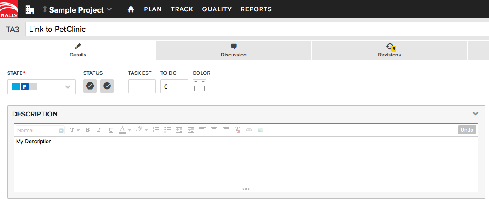

# Preface #

This document describes the functionality provided by the xlr-rally-plugin.

See the **[XL Release Documentation](https://docs.xebialabs.com/xl-release/index.html)** for background information on XL Release and release concepts.

# CI status #

[![Build Status][xlr-rally-travis-image] ][xlr-rally-travis-url]
[![Build Status][xlr-rally-codacy-image] ][xlr-rally-codacy-url]
[![Build Status][xlr-rally-code-climate-image] ][xlr-rally-code-climate-url]

[xlr-rally-travis-image]: https://travis-ci.org/xebialabs-community/xlr-rally-plugin.svg?branch=master
[xlr-rally-travis-url]: https://travis-ci.org/xebialabs-community/xlr-rally-plugin
[xlr-rally-codacy-image]: https://api.codacy.com/project/badge/Grade/b74aca3c5da7483193ceef88bc93ec44
[xlr-rally-codacy-url]: https://www.codacy.com/app/rvanstone/xlr-rally-plugin
[xlr-rally-code-climate-image]: https://codeclimate.com/github/xebialabs-community/xlr-rally-plugin/badges/gpa.svg
[xlr-rally-code-climate-url]: https://codeclimate.com/github/xebialabs-community/xlr-rally-plugin

# Overview #

The xlr-rally-plugin is a XL Release plugin that allows to integrate XL Release with Rally.

# Requirements #

* **Requirements**
	* **XL Release** 4.x
        * [Rally Rest Toolkit for Java](https://github.com/RallyTools/RallyRestToolkitForJava)

# Installation #

* Place the plugin JAR file into your `SERVER_HOME/plugins` directory.
* Place the Rally Rest Toolkit jarfile into your `SERVER_HOME/lib` directory.
* Restart the server  

# Types #

+ UpdateProperties

# Usage #

First, you need to add an entry in the [Configuration](https://docs.xebialabs.com/xl-release/how-to/create-custom-configuration-types-in-xl-release.html#configuration-page) section with information on how to connect to your Rally instance:

The next step is to add the required task [Types](#Types) to your release template, for example:

Note, properties are defined in the following format

`{ "property1Name" : "property1Value","property2Name" : "property2Value" }`

In the example above the Task TA3 has been updated with a new description and it's state has been progressed.

### Rally object reference ###
##### Defect #####
* code: DE
* default state progression: Submitted, Open, Fixed, Closed

##### Defect Suite #####
* code: DS

##### Iteration #####
* default state progression: Planning, Committed, Accepted 

##### Task #####
* code: TA
* default state progression: Defined, In-Progress, Completed

##### Test Case
* code: TC 

##### User Story #####
* code: US

